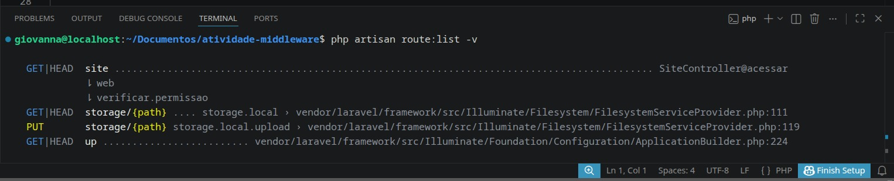
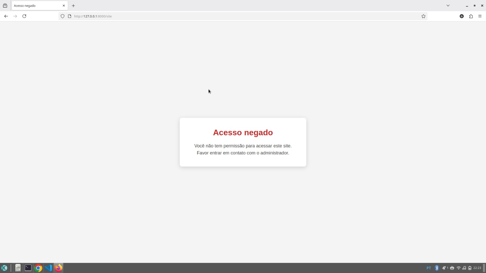

# 🔐 Atividade Middleware — Laravel

Projeto desenvolvido como atividade acadêmica para demonstrar o funcionamento de **Middleware no Framework Laravel**.

A aplicação possui uma rota protegida por um Middleware responsável por verificar o acesso do usuário. Quando o acesso não é permitido, uma mensagem é enviada para uma **View Blade** informando que o usuário não possui permissão para acessar o site.

---

## 📚 Objetivo

O objetivo desta atividade é compreender na prática a comunicação entre os principais componentes do Laravel:

```text
Rota
  ↓
Controller
  ↓
Middleware
  ↓
View
```

O projeto demonstra como um Middleware pode **interceptar uma requisição** antes que ela prossiga normalmente para a aplicação.

---

## 🛠️ Tecnologias utilizadas

* **PHP**
* **Laravel 13**
* **Blade**
* **HTML5**
* **CSS3**
* **Composer**
* **Git e GitHub**

---

## 📂 Estrutura principal

```text
atividade-middleware/
│
├── app/
│   └── Http/
│       ├── Controllers/
│       │   └── SiteController.php
│       │
│       └── Middleware/
│           └── VerificarPermissao.php
│
├── bootstrap/
│   └── app.php
│
├── public/
│   └── css/
│       └── style.css
│
├── resources/
│   └── views/
│       ├── site.blade.php
│       └── sem-permissao.blade.php
│
├── routes/
│   └── web.php
│
├── prints/
│   ├── middleware-terminal.jpeg
│   └── mensagem-site.jpeg
│
├── .env.example
├── artisan
├── composer.json
└── README.md
```

---

## 🔄 Funcionamento

Quando o usuário acessa a rota:

```text
/site
```

a requisição passa pelo Middleware `VerificarPermissao`.

O fluxo da aplicação funciona da seguinte maneira:

```text
🌐 Usuário acessa /site
          ↓
🛣️ Rota Laravel
          ↓
🎮 SiteController
          ↓
🔐 VerificarPermissao
          ↓
❌ Acesso não permitido
          ↓
🖥️ View sem-permissao.blade.php
          ↓
💬 Mensagem de acesso negado
```

---

## 🔐 Middleware

O Middleware utilizado no projeto é:

```text
VerificarPermissao
```

Ele é responsável por interceptar a requisição e impedir que o usuário continue para a página protegida.

Quando o acesso não é permitido, o Middleware retorna a View:

```text
sem-permissao.blade.php
```

com a seguinte mensagem:

> **Você não tem permissão para acessar este site.**  
> **Favor entrar em contato com o administrador.**

---

## 🎮 Controller

O Controller utilizado é:

```text
SiteController
```

Ele possui o método:

```php
public function acessar()
{
    return view('site');
}
```

O Controller representa a etapa responsável por receber a requisição e direcionar o fluxo da aplicação.

---

## 🖥️ View

A mensagem de acesso negado é exibida através da View:

```text
resources/views/sem-permissao.blade.php
```

Foi utilizado um CSS simples para organizar a apresentação da mensagem na tela.

---

## 📸 Evidências da atividade

### 🔎 Middleware registrada na rota

Para verificar as rotas cadastradas no Laravel, foi utilizado o comando:

```bash
php artisan route:list -v
```

O resultado demonstra que a rota `/site` está vinculada ao `SiteController` e à Middleware `verificar.permissao`.



Na execução é possível identificar:

```text
GET|HEAD  site
SiteController@acessar
web
verificar.permissao
```

Isso comprova que a Middleware está associada à rota `/site`.

---

### 🌐 Mensagem exibida no navegador

Após iniciar o servidor Laravel com:

```bash
php artisan serve
```

foi acessada a seguinte rota:

```text
http://127.0.0.1:8000/site
```

A Middleware interceptou a requisição e exibiu a mensagem definida na View.



### 💬 Mensagem apresentada

```text
Acesso negado

Você não tem permissão para acessar este site.

Favor entrar em contato com o administrador.
```

---

## 🚀 Como executar o projeto

### 1. Clone o repositório

```bash
git clone https://github.com/GiT0rres/Atividade-Middleware.git
```

### 2. Entre na pasta

```bash
cd Atividade-Middleware
```

### 3. Instale as dependências do Laravel

```bash
composer install
```

### 4. Crie o arquivo `.env`

```bash
cp .env.example .env
```

### 5. Gere a chave da aplicação

```bash
php artisan key:generate
```

### 6. Inicie o servidor

```bash
php artisan serve
```

### 7. Acesse a aplicação

Abra no navegador:

```text
http://127.0.0.1:8000/site
```

---

## 📌 Resultado esperado

Ao acessar a rota protegida, o sistema deverá apresentar:

```text
Acesso negado

Você não tem permissão para acessar este site.

Favor entrar em contato com o administrador.
```

---

## 🎓 Atividade acadêmica

Projeto desenvolvido para fins **educacionais**, com o objetivo de estudar e praticar o conceito de **Middleware no Laravel**.

**Framework:** Laravel 13  
**Linguagem:** PHP  
**Tema:** Controller, Middleware e View
